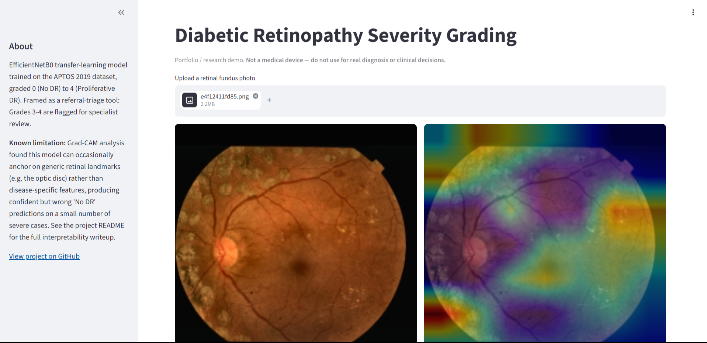
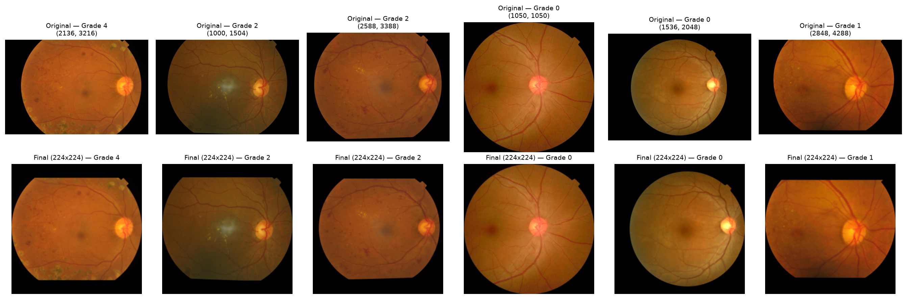
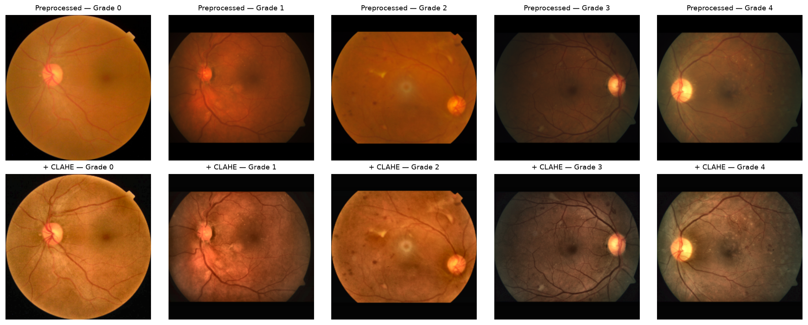
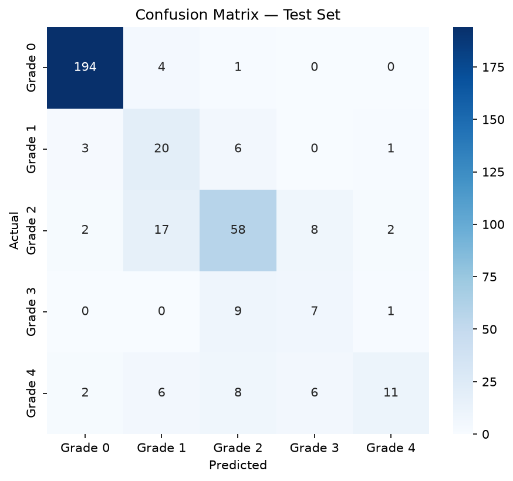
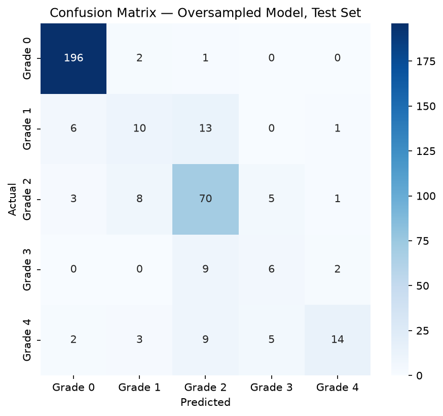
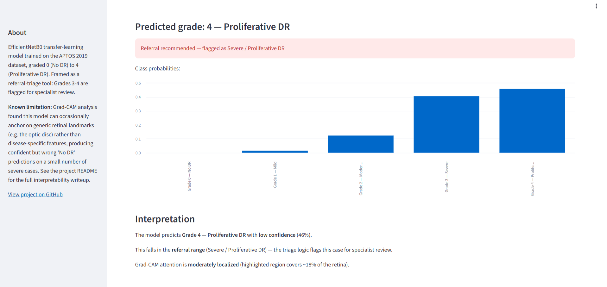

# Diabetic Retinopathy Severity Grading + Lesion Localization

A deep learning project to classify diabetic retinopathy (DR) severity from
retinal fundus photographs, with interpretability (Grad-CAM) used to
investigate whether the model is looking at real lesions or confounding
image properties — framed as a clinical triage system (refer / no-refer),
not just a 5-class classifier.

**[Live demo](#)** — replace with your deployed Streamlit/HF Spaces link



## Problem

Diabetic retinopathy is a leading cause of preventable blindness, graded on
a standard 5-point scale from retinal fundus photographs:

| Grade | Name | Description |
|---|---|---|
| 0 | No DR | Healthy retina |
| 1 | Mild | A few microaneurysms |
| 2 | Moderate | More microaneurysms + hemorrhages |
| 3 | Severe | Extensive hemorrhages, venous beading |
| 4 | Proliferative | Abnormal new blood vessel growth — sight-threatening |

In real deployment, this model would support screening in settings with too
few ophthalmologists — flagging patients who need urgent specialist referral
(grades 3-4) rather than just predicting a grade in isolation.

## Dataset

- **Source:** APTOS 2019 Blindness Detection
- **Splits:** pre-defined train (2930 images) / valid (366) / test (366),
  each with its own `id_code` → `diagnosis` (0-4) CSV
- **No patient ID field available** in this public version — a strict
  patient-level leakage check isn't possible with the given metadata.
  Duplicate-image detection (below) is used as the practical substitute.

## Repo Structure

```
project/
|── 01_eda.ipynb
│── 02_preprocess.ipynb
│── 03_model_training.ipynb
│── 04_class_imbalance_experiment.ipynb
├── src/
│   ├── data_utils.py
│   └── preprocessing.py
├── outputs/
│   ├── figures/
│   └── models/
│   └── gradcam_based_on_classweight/
│   └── gradcam_based_on_oversampling/
├── app.py                  # Streamlit deployment demo
├── requirements.txt
├── requirements-app.txt    # only for streamlit purpose 
└── README.md
```

**Convention:** any function used in more than one place lives in `src/`,
imported into notebooks — not re-pasted. One-off investigative code stays
inline in the notebook it belongs to.

---

## 1. EDA (`01_eda.ipynb`)

### Data integrity

| Check | Result |
|---|---|
| Missing / corrupted files | 0 / 0 |
| Duplicate images within train | 79 pairs found and de-duplicated |
| Train↔Valid / Train↔Test leaks | 22 + 22 found and removed from train |

~6% of valid/test had a byte-identical duplicate in train — left unfixed,
this would have inflated validation/test metrics via memorization rather
than genuine generalization. Leaks were removed from `train` only.
Post-cleaning training set: 2,930 → 2,886 images.

### Class imbalance

| Grade | Count | % of data | Imbalance ratio |
|---|---|---|---|
| 0 | 1432 | ~53% | 1.00x |
| 1 | 291 | ~11% | 4.92x |
| 2 | 784 | ~29% | 1.83x |
| 3 | 152 | ~5.6% | **9.42x** |
| 4 | 227 | ~8.4% | 6.31x |

Grades 3-4 — the clinically most important cases — are also the rarest.
**Decision: never drop data to balance classes**; handle imbalance at the
training level instead, and evaluate with QWK + per-class recall, not
accuracy.

### Blur / sharpness — real, flagged finding

| Grade | Mean blur score (Laplacian variance) |
|---|---|
| 0 | ~37 |
| 1-4 | ~13-15 |

Grade 0 images are consistently ~2.5x sharper than every diseased class,
across train/valid/test — counter-intuitive, since diseased retinas have
more fine detail. Flagged as a possible shortcut risk, carried into the
Grad-CAM investigation (Section 4).

### Color-channel hypothesis — tested, ruled out

Visual impression (grade 0 = yellower) did not hold up quantitatively —
R:G ratio stayed ~1.8-2.1 across all classes with no trend by grade.
Documented as a deliberately tested, ruled-out hypothesis.

---

## 2. Preprocessing (`02_preprocess.ipynb`)

**Pipeline:** `crop black border → pad to square → resize to 224×224 →
CLAHE → BGR→RGB → EfficientNet input scaling`



- **Crop + pad-to-square** instead of center-crop or stretch — preserves
  all real tissue and avoids distorting the circular retina.
- **CLAHE** tested visually and retained — improved vessel/lesion contrast
  without amplifying noise in the black background.



- **`tf.data` pipeline:** `load/process → cache → shuffle (train) → batch →
  augment (train) → prefetch`. Caching sits before augmentation so
  deterministic OpenCV work is reused across epochs while augmentation
  stays random.
- **Augmentation:** flips + mild rotation only — no color/brightness
  augmentation, since EDA flagged both blur and color as potentially
  carrying real diagnostic signal.

---

## 3. Modeling (`03_model_training.ipynb`)

**Architecture:** EfficientNetB0 (ImageNet pretrained) → GlobalAveragePooling
→ Dropout → Dense(5, softmax).

**Two-phase transfer learning:**
1. **Phase 1** — frozen backbone, train head only (LR=1e-3)
2. **Phase 2** — unfreeze last 30 layers, BatchNorm kept frozen, fine-tune
   (LR=1e-5, `ReduceLROnPlateau`, `EarlyStopping`)

A bug was found and fixed mid-project: BatchNorm layers' `trainable` flag
was unconditionally overwritten to `True` after being set `False` in the
first fine-tuning attempt. Fixed (`if/else`, not two unconditional
statements) and retrained cleanly before trusting any results.

**Baseline evaluation (class weights for imbalance):**



| Metric | Value |
|---|---|
| QWK | 0.826 |
| Accuracy | 0.790 |
| Grade 3 recall | 0.412 |
| Grade 4 recall | 0.333 |

---

## 4. Class Imbalance Experiment (`04_class_imbalance_experiment.ipynb`)

**Single-variable ablation:** replaced class weights with moderate
oversampling of Grades 3 (4x) and 4 (3x) — everything else (architecture,
LR schedule, callbacks) held identical, to isolate the effect of the
correction mechanism itself.



| Metric | Baseline (class weights) | Oversampled |
|---|---|---|
| QWK | 0.826 | **0.854** |
| Accuracy | 0.790 | 0.809 |
| Grade 0 recall | 0.975 | 0.985 |
| Grade 1 recall | 0.667 | **0.333** |
| Grade 2 recall | 0.655 | **0.805** |
| Grade 3 recall | 0.412 | 0.353 |
| Grade 4 recall | 0.333 | **0.424** |

**Conclusion:** oversampling improved the headline metric and the most
clinically critical class (Grade 4), and boosted Grade 2 substantially.
It came at a real cost to Grade 1 recall — removing class weights took
away Grade 1's only correction while it wasn't included in the
oversampling target, leaving it under-protected relative to its larger
neighbors. **Net decision: the oversampled model is carried forward** as
the better fit for this project's triage framing (catching severe cases
matters more than a missed mild case), with the Grade 1 regression
documented as a known, explained trade-off rather than an unnoticed
regression.

*Known limitation of the method itself:* oversampling duplicates existing
images (with fresh augmentation per repeat) — it adds exposure, not new
information. This ceiling shows up directly in Section 5 below.

---

## 5. Interpretability — Grad-CAM (in `04_class_imbalance_experiment.ipynb`)

Grad-CAM was used to investigate *why* the model fails, not just how often,
focused on the most severe error type: Grade 4 (proliferative,
sight-threatening) predicted as Grade 0 (no DR).

**Two distinct failure modes were found, not one:**

**A) Boundary-adjacent errors — fixed by oversampling.**
Grade 4→Grade 1 misclassifications dropped from 6 to 3, and correct Grade 4
predictions rose from 11 to 14, after oversampling. These were cases where
the model was close to right and more exposure to the class was enough to
shift the decision.

**B) Anchored/shortcut errors — unaffected by oversampling.**
The two most severe errors (Grade 4→Grade 0) were **identical in both
models** — same two images, same wrong prediction, near pixel-for-pixel
identical Grad-CAM heatmaps:


Attention in both cases fixates tightly on the **optic disc** — a normal
anatomical landmark, not disease tissue — rather than searching the retina
for lesions. Tripling training exposure to Grade 4 had **zero effect** on
these two cases, indicating the failure is a learned shortcut robust to
more of the same kind of training signal, not a data-volume problem.

**Hypothesis tested and ruled out:** checked whether these two images were
unusually blurry (per the EDA blur finding). Blur scores were 16.4 and
15.4 — squarely within the normal range for diseased grades (~13-15), far
from Grade 0's ~37. **Blur is not the cause of this specific shortcut.**
The anchoring mechanism remains an open question, noted as future work.

**Contrast — a genuinely correct Grade 4 case, for comparison:**


Attention here aligns with visible pathology (vessel proliferation, exudate
regions) rather than a generic landmark — the qualitative difference
between this and the anchored failures above is the clearest evidence in
the project that Grad-CAM is surfacing a real, meaningful distinction, not
noise.

**Overall interpretability conclusion:** the severity of a prediction error
correlates with how localized vs. diffuse/anchored the model's attention
is. Near-correct predictions show lesion-aligned attention; catastrophic
errors show attention fixated on generic structures, resistant to the
imbalance-correction technique tried here.

---

## 6. Deployment (`app.py`)

A Streamlit demo: upload a fundus photo → preprocessed image + Grad-CAM
overlay → predicted grade + class probabilities → referral flag → a
plain-language interpretation that explicitly surfaces the model's known
limitation on high-confidence "No DR" predictions.



Run locally: `streamlit run app.py`. Deployable free on Streamlit Community
Cloud or Hugging Face Spaces (CPU-only hosting works fine — mixed precision
was never actually active during training due to a policy-ordering detail,
so the saved model is plain float32).

---

## Environment Notes

- Trained locally on an RTX 3050 (4GB VRAM) via WSL2 + CUDA — native
  Windows TensorFlow dropped GPU support after 2.10.
- Backbone: EfficientNetB0, chosen over MobileNetV3 based on deployment
  target (server-side inference, not on-device) and domain precedent
  (EfficientNet dominates published APTOS/EyePACS solutions).
- Batch size 16; `tf.data` pipeline required to keep the GPU fed.

## Project Status

- [x] EDA — data integrity, imbalance, image properties, blur, color
- [x] Preprocessing pipeline — cropping, resize, CLAHE, `tf.data`, augmentation
- [x] Baseline training — two-phase transfer learning, QWK 0.826
- [x] Class imbalance ablation — oversampling vs. class weights, QWK 0.854
- [x] Interpretability — Grad-CAM, two distinct failure modes identified
- [x] Deployment — Streamlit demo with referral flag and limitation disclosure

## Known Limitations & Future Work

- No patient-ID metadata — cross-session leakage beyond exact duplicates
  can't be fully verified.
- Oversampling adds exposure, not new information — a real ceiling on how
  much it can help rare-class recall.
- Two persistent Grade 4→Grade 0 shortcut failures remain unexplained by
  blur; likely candidates for future investigation: attention supervision,
  contrastive learning on hard negatives, or targeted acquisition of more
  real (not duplicated) Grade 3/4 images from a compatible-scale dataset
  (e.g. IDRiD).
- A domain-generalization extension (training/evaluating across multiple
  DR datasets, as in benchmarks like GDRBench) was considered and
  deliberately scoped out — a legitimate but substantially larger research
  direction, better suited to a dedicated follow-up project.
